# Kisapalvelu KIPA -- Käyttöohje

## Näin pääset alkuun

Tervetuloa tutustumaan 2010-luvun partiotaitokilpailujen
tuloslaskentaohjelmistoon. Mikäli olet uusi Kipalle kokonaisuudessan
suosittelemme lukemaan vähintään kohdat asennus sekä tehtävien määritys.

Monet toiminnallisuudet ovat intuitiivisia ja ne on helppo päätellä,
toisaalta monessa paikassa voi olla apua lukea tämä ohje kattavasti
läpi, erityisesti tehtävien määritys menee jouhevammin, mikäli malttaa
tutustua dokumentaatioon ensin. Kipa tarjoaa monipuolisen tavan
toteuttaa laskentaa ja moni asia voidaan laskea helpommin koneellisesti,
mitä aiemmin on laskettu käsin.

Riemukkaita laskentahetkiä!

## Mikä on Kipa ja mitä sillä voi tehdä

### Yleistä

Kipa eli Kisapalvelu on partiokilpailujen tuloslaskentaa helpottamaan
tehty ohjelmisto. Kipa on helppokäyttäinen ja se on vapaasti
levitettävissä sekä muokattavissa. Ohjelmisto kehittyy edelleen joten
tarkista aina uusimman version saatavuus.

### Ominaisuudet

* **Selainkäyttö**: Kisatoimistossa koneet joilta tuloksia syötetään ei vaadi ohjelmien asentamista, Kipaa voi käyttää Internet-selaimella.
* **Monen käyttäjän tuki**: Kisatoimistossa voi syöttää usealla koneilla esimerkiksi eri sarjoja tai eri tehtäviä.
* **Tuomarineuvostofunktio**: Lasketun tuloksen voi korvata "kovalla arvolla" jos laskettu tulos ei jostain syystä kelpaa.
* **Tulokset Exceliin**: Tulokset saa ulos CSV-tiedostona joka helpottaa printtien yms. tekemistä.
* **Monta yhtäaikaista kilpailua**: Yhdelle palvelimille voidaan asentaa käytännössä ääretön määrä kilpailuja joita voivat muut koneet käyttää.
* **Tulosten syöttö kahteen kertaan**: Erityisesti SM-kilpailuita varten toteutettu ominaisuus jolla voidaan eliminoida kirjoitusvirheiden vaikutus.
* **Tuloslaskennen tilannenäkymä**: Graafinen näkymä helpottaa tuloslaskennan ja tarkastuksen etenemisen hahmottamista.
* **Ilmainen ja vapaasti kehitettävä**: Kipaa saa vapaasti levittää ja muokata kunhan edelleen kehitetyt versiot ovat vapaasti saatavilla myös muille.
* **Vapaa kaava**: Tehtävän kaava voidaan määrittää matemaattisesti lähes millaiseksi tahansa.
* **Valmiit tehtävämallit**: Yleisimpiä tehtäviä kuten suorasumma, interpolointi tai aikaväli varten on valmiit pohjat jotka nopeuttavat käyttöä.
* **Tehtävien kopiointi**: Sarjasta toiseen tai sarjan sisällä tehtävien kopiointi.
* **Windows- ja Linux-tuki**: Palvelin voidaan asentaa sekä Windows- & Linux-koneille, myös pilotoitu OS X -koneille.
* **Varmuuskopiointi**: Kilpailun tulokset voidaan tuoda XML-varmuuskopiona tai siirtää toiselle koneelle.
* **Tupan ominaisuudet**: Perinteikkään Tupan ominaisuudet on pyritty tuomaan mahdollisimman pitkälti myös Kipaan.

## Referenssit

Esimerkkejä kisoista, joita on laskettu Kipalla:

* Punkku 2009 - Harmaa Sarja
* Päpa Piirin kevät kisat 2010
* Peikon Puikaus 2010
* Letto \'10
* Punkku 2010
* Järvi-Suomen piirin Syyskisat 2011

## Asennusohje sekä poisto-ohje

### Miten Kipa toimii

Kipa asennetaan yhdelle tietokoneelle, jolta käsin voidaan syöttää
kilpailun tiedot ja tulokset. Kipan hienoutena on kuitenkin että samaa
kisaa voidaan verkon yli käyttää myös muilta päätteiltä, jotka voivat
periaatteessa olla mitä tahansa laitteitta, joissa on Internet-selain. Kone,
jolle Kipa on asennettu toimii palvelimena. Kaikki kisan tiedot pidetään
tallessa keskitetysti palvelinkoneella, jonka pitää luonnollisesti olla
päällä jotta muut koneet voivat olla siihen yhteydessä.

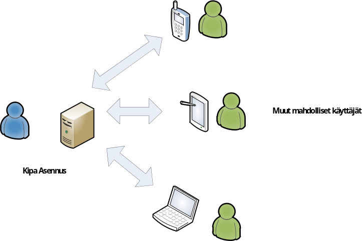

Tyypillisesti Kipa asentuu Apache-ohjelmiston päälle, joka käynnistyy
samalla kun tietokone käynnistetään.

### Windows

Lataa Suomen Partiolaisten sivuilta Kipan asennuspaketti ja käynnistä se
koneelta, jolle Kipa asennetaan ja joka toimii kisan palvelimena.

Suorita Windows-asennuspaketti ja vastaa joka kohtaan jossa kysytään
jatkoa OK, Next, Yes, Finish yms. Älä muuta arvoja ellet ole täysin
varma siitä, mitä teet.

Windows installeri (Windows Vista, Windows 7 testattu). Testattu sekä 32
että 64-bittisillä järjestelmillä.

Tämän jälkeen koneellesi on asennettu Apache ja Python (osittain), sekä Kipa.

Osoitteesta
[http://localhost/kipa/](http://localhost/kipa/)
pitäisi tämän jälkeen löytyä Kipa. Ohjelmaa ei tarvitse erikseen käynnistää.

Katso lisätietoja-kohdasta verkkokäyttö mikäli tarvitset useamman
käyttäjän yhtäaikaisen mahdollisuuden.

Jos et tarvitse ohjelmaa enää, katso kohta poistaminen.

### Linux

Kipa on testattu useissa Red Hat -, Ubuntu- sekä Debian-koneissa. Tarjolla
on sekä asennuspaketti DEB-muodossa että manuaalinen vaihtoehto ja jos
kirjastojen kanssa tulee ongelmia voi kehittäjädokumentaatiosta löytää
tiedon tarvittavista muutoksista.

Ohjelmassa ei ole mitään käännettävää, kunhan riippuvuudet ja konfiguraatiot
on kehitysdokumentaation mukaisesti on Kipa helppo asentaa.

### Apple, OS X

OS X:n päällä ainoa testattu tapa on käyttää Djangon omaa
kehityspalvelinta, josta kehitysdokumentaatiossa enemmän. Myös Apache
lienee mahdollinen, mutta ei testattu. Vakavahenkistä kisaa varten
kannattaa toimivuutta testata lisää ennen kilpailua.

### Vmware image

Vmware tarjoaa mahdollisuuden ajaa toista käyttöjärjestelmää
virtualisoituna oman käyttöjärjestelmän sisällä. Tämän option
käyttämiseen tarvitaan Vmware-player, Vmware-server (molemmat ilmaisia)
tms. tuote joka osaa tämän tehdä.

Image voi olla hyödyllinen esimerkiksi kun Kipan käyttämät Python ja
Django versiot eivät löydy helpolla, käyttää ei suoraan tuettua
käyttöjärjestelmää tai Windows asennus yskii.

Image on ladattavissa verkosta ja siihen on tunnus kipa / salakala

1. Asenna sopiva Vmware tuote
2. Lataa image
3. Pura image ja käynnistä se Vmwarella
4. Päivitä Kipan data tiedostot ajantasalle.

Verkko asetuksen tulisi olla sillattu, jotta voidaan käyttää montaa
käyttäjää yhtä aikaa.

Vieraile tupa2.sf.net Imagen linkkiä varten.

### Muut käyttöjärjestelmät / itse muokattava asennus

Mikäli koneella on esimerkiksi Apache pyörittämässä jotain muuta
sovellusta, haluaa käyttää jotain toista http palvelinta tai
käyttöjärjestelmää on tässä kuvattu mitä tarvitaan Kipan asentamiseen ja
pyörittämiseen.

Kipaa ei missään tapauksessa kannata asentaa automaattipaketeilla
tietokoneelle missä on jo Apache asennettuna!

Kipan laskenta perustuu Pythonin-ohjelmointikielellä kirjoitettuun koodiin.
Python 2.5-2.6 on testattu ja tuettu.

Kipan web-julkaisu ja kantayhteydet djangoon. Djangon versiot 1.0 sekä
1.1 on testattu (nämä ovat melko nirsoja tod. näk. uusiin versioihin)

Koneelle pitää asentaa http-palvelin joka osaa suorittaa python koodia
esimerkiksi modpython moduulin avulla ja lisäksi tarjota djangolle oma
"hakemisto", jossa se toimii. Tässä kannattaa tutustua Kipaa varten
muokattuun httpd.conf tiedostoon
([www.tupa2.sf.net](http://www.tupa2.sf.net)).

Web-tiedostot kopioidaan samaan hakemistoon, johon on määritelty Djangon
oma hakemisto

Asennus niille jotka luulee tietävänsä mitä tekee tai haluaa ymmärtää.

### Asennuksen poistaminen

#### Windows

1. Poista Apache (lisää-poista sovelluksia kautta)
2. Poista C:\\Kipa

#### Linux + muut

1. Poista Apache
2. poista hakemisto /data

## Kipan käyttö

Kipa on kokonaisuudessaan web-applikaatio joten sen käytössä kannattaa
huomioida joitain yleisiä käyttöä helpottavia tekijöitä.

* Kun teet muutoksia Kipan tehtäviin, syötteisiin vartioihin yms.
  muista painaa aina lopuksi "Tallenna" sillä muuten menetät
  tekemäsi muutokset.
* Navigoidessa suosittelemme käyttämään mieluummin Kipan valikoita
  kuin selaimen takaisin tai eteenpäin nappuloita.

### Kisan luominen

Avaa Kipa auki http://localhost/kipa/ osoitteesta jos Kipa on asennettu
omalle koneellesi. Jos tulostoimistossa on monta konetta jotka syöttävät
samaa kilpailua katso kohta verkkokäyttö.

Valitse "Uusi Kisa"

Määrittele kisalle nimi ja ainakin yksi sarja.

Tallenna.

### Määritä vartiot

Valitse sarja.

Syötä vartion tiedot:

* **Nro**: Vartion numero
* **Nimi**: Vartion nimi
* **Keskeyttänyt**: Jos vartio keskeyttää, kirjataan ensimmäisen
  tekemättä jätetyn tehtävän tehtävänumero.
* **Ulkopuolella**: Jos vartio siirtyy kisan ulkopuolelle, kirjataan ensimmäisen
  kisan ulkopuolella suoritetun tehtävän numero. Kirjataan "1", mikäli
  vartio kisaa kisan ulkopuolella kisan alusta asti.
* **Poista**: Pistä ruksi jos haluat poistaa vartion (ei tarvitse tehdä tyhjille)

Paina lopuksi "Tallenna"

Huom! Mikäli vartio jossain vaiheessa keskeyttää tai siirtyy kilpailun
ulkopuolelta muista palata tänne määrittelemään tämä tieto.

### Tulosten syöttö

Tulosten syötössä syötetään jokaiseen tehtävään sen osatehtävien
syötteet. Kipa syöttää itse tiedon, mikäli vartio on kilpailun
ulkopuolella tai keskeyttänyt ja tällöin ei vartion syötteitä tarvitse
tässä huomioida. Muista merkitä vartiot ulkopuolelle / keskeyttäneeksi.

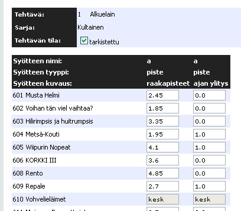

Yllä olevassa kuvassa näkyy tehtävän, osatehtävien syötekentät.
Vasemmalla on ensimmäisen osatehtävän syötekentät, joihin
syötetään raakapisteitä ja oikealle puolelle jos vartio on
ylittänyt ajan (-1 piste). Yllä on "tarkistettu"-ruutu. Kun tämä ruutu on
ruksittu ja tiedot tallennettu näkyy laskennan tilanne alla että nämä
tulokset on tarkistettu. Tätä voidaan hyödyntää kisatoimistoissa, jossa
käytetään kaksia silmiä tarkistamaan syötteiden oikeellisuus.

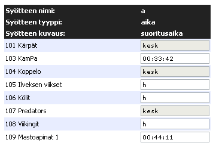

Mikäli vartion suoritus on hylätty syötetään h-kirjain vartion
tulokseksi. Ajan syötössä käyteään syötemuotoa HH:MM:SS kuten yllä
näkyy.

### Tuplasyöte

Etusivun valikosta löytyy toiminto tuplasyöte. Tälle toiminnallisuudella
on käyttöä kilpailuissa joissa tulosten oikeellisuus pitää varmistaa
syöttämällä luvut kahteen kertaan kirjoitusvirheiden varalta.

Ensin syötetään tulokset normaalisti. Kun tehtävän tulokset
on syötetty kertaalleen voidaan tuloksia alkaa syöttämään toiseen
kertaan. Painetaan "Tallenna" kun syöttäminen on valmis.

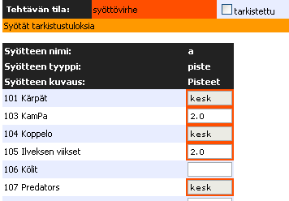

Järjestelmä näyttää punaisella solut, joiden syöte ei täsmää
ensimmäisellä kerralla syötettyyn.

### Tuomarineuvostyökalu

Työkalulla voi syöttää tuloksia vartioille joiden tulosta ei syystä tai
toisesta voida laskea normaalisti vaan se pitää syöttää "kovana
arvona". Jos tuloksissa näkyy yllättäviä arvoja, kannattaa tarkistaa,
ettei tuomarineuvostotyökaluun ole epähuomiossa syötetty arvoja.

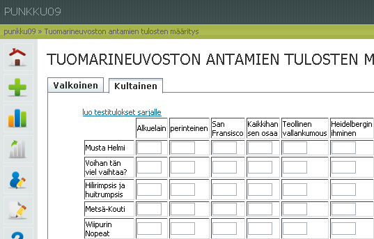

### Varmuuskopiointi / Vieminen / Palauttaminen

Kisan tiedot on mahdollista viedä talteen yhtenä XML-dumppina.
Tälle voi olla tarvetta, mikäli haluaa esimerkiksi tehdä jotain
testailuja olemassa olevaan konfiguraatioon, ottaa varmuuskopion tai
viedä jollekkin toiselle koneelle kilpailun kaikki tiedot.

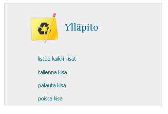

Tallenna kisa -toiminnolla saa XML-tiedoston, jonka voi tallentaa
koneelle. Palauta kisa -toiminnolla taas voidaan XML-tiedostosta
palauttaa kisa.

### Laskennan tilanne

Laskennan tilanne -näkymästä näkee minkä tehtävien syötteet on syötetty
kokonaan/osittain/ei ollenkaan. Värit kertovat yhdessä näkymässä jokaisesta
sarjasta, miten pitkällä tehtävien syöttö on.


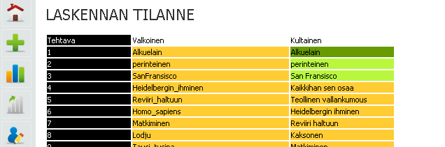

### Tulosten vienti CSV-tiedostoon

Jos tuloksia on tarvetta muokata, suodattaa tai tulostusnäkymää
jalostaa on helpointa viedä tulokset CSV-muotoon jolloin niitä voidaan
muokata esimerkiksi Excel-ohjelmalla. Tulosnäkymä sivulta löytyy
jokaisen sarjan tuloksille "Tulokset CSV tiedostoon"-painike, josta painettaessa
ohjelma antaa sarjan tulokset ulos yhtenä tiedostona.

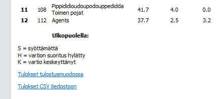

## Tehtävät yleistä

Ennen kuin tekee tehtävän määrittelyä on hyvä ymmärtää lyhyt oppimäärä
miten Kipa laskee tuloksia.

Kipassa on jokaisessa sarjassa erilliset tehtävät, tehtävät tulee
numeroida. Tehtävien numeroinnin tulee vastata järjestystä jossa sarjan
vartiot suorittavat tehtäviä. Jokainen tehtävä koostuu osatehtävistä,
jotka on nimetty a -- z. Viittaukset osatehtävien nimiin syntyvät
automaattisesti. Tehtävän kaava on koostuu osatehtävien viittauksista.
Jokainen osatehtävä koostuu syötteistä joille tulee syöttää kuvaus
tehtävän määrittelyvaiheessa (esim. juoksuaika).

Kun selaa tehtäviä näkyvät tehtävänumerot ja numerot. Kun katsoo tehtävän
"ylätason" tietoja nähdään vastaavasti osatehtävien nimet ja niiden
kaava. Osatehtävillä on taas omat syötteensä ja kaavansa

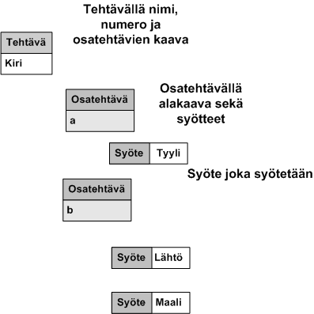

### Määritä tehtävät, yleisnäkymä

Jokaisella sarjalla on omat tehtävät. Saman nimisiä tehtäviä voi olla
eri sarjoissa ja kisoissa, mutta ne ovat laskennassa täysin irrallisia
toisistaan. Tulosten laskennassa esimerkiksi interpoloinnit menee
sarjojen sisällä.

Tehtäviä (nimi+määrittelyt) voi kopioida toisesta sarjasta. Kannattaa
ensin tehdä tehtävät yhteen sarjaan ja sen jälkeen kopioida ne muihin
sarjoihin. Yleisesti kannattaa tehdä ensin yksi sarja jossa on eniten
tehtäviä ja sen jälkeen duplikoida sarjan tehtävät myös muihin sarjoihin
ja muuttaa sopivilta osin mikäli tarvetta.

Valitse "Lisää tehtävä", kun olet tekemässä uutta tehtävää.

Kun haluat kopioida sarjan toisesta sarjasta, valitset ensin sarjan
mihin haluat kopioida, sen jälkeen valitse kopioi tehtävä ja sitten voit
valita mitkä tehtävät haluat kopioida sarjaasi.

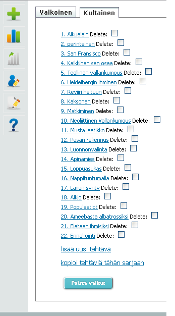

### Tehtävän kaavan määrittely

Syötä Nimi-kenttään vartion nimi ja Järjestysnumero-kenttään tehtävän
järjestysnumero, on tärkeää laittaa tehtävät oikeaan järjestykseen --
muuten kisan ulkopuolelle siirtyvät / keskeyttäneet vartiot ovat väärin
mukana tehtävien järjestyksessä. Järjestysnumeron pitää kuvata sitä
järjestystä, jossa vartiot kiertävät rataa.

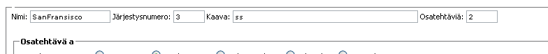

Tehtävän kaava on oletuksena ss (suorasumma) ja osatehtävien määrä on
yksi. Jos tehtävässä on yksi osatehtävä on silloin on ensimmäinen
osatehtävän nimi a. Kun osatehtävien määrä kasvaa aakkosjärjestyksessä
osatehtävien nimen viittaus tapahtuu kirjaimilla a -- z. Osatehtävät tulee
näkyviin allekkain a -- z.

Suurin osa tehtävistä lasketaan kaavalla ss - tällöin esimerkiksi ajasta
sekä kätevyydestä saadut pisteet lasketaan yhteen.

Kehittyneempiä kaava esimerkkejä:

* `a-b` -- Lasketaan esimerkiksi ajan pisteet, josta vähennetään sakkopisteet. Määritellään kaksi osatehtävää.
* `(a+b)/c` -- Lasketaan yhteen kaksi kätevyyttä ja niiden summa jaetaan aikasakolla. Määritellään kolme osatehtävää.
* `b*2+a/c` -- tehtävän pisteet\*2 + aika/sakolla

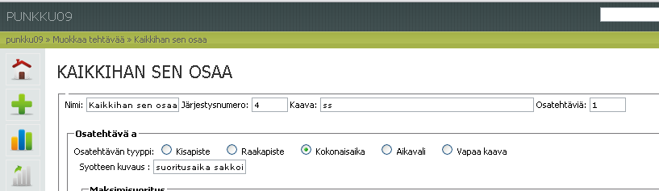

Ja monimutkaisempaa laskentaa

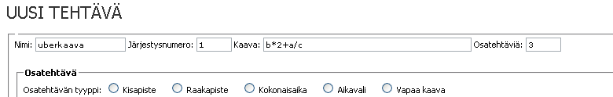

### Yleistä pistetyypistä interpolointi vs. kiinteät arvot

Interpoloinnnisa vartioiden suorituksia verrataan toisiinsa. Kiinteissä
arvoissa taas verrataan vartion suoritusta etukäteen järjestejien
asettamiin arvoihin tai maksimi/minimi arvoihin.

Interpolointitehtävissä, joissa paras suoritus on
mahdollisimman pieni arvo käytetään nollasuorituksen arvona
useimmiten 0.5 kertaa keskimmäinen suoritus. Vastaavasti jos suoritus on
sitä parempi, mitä suurempi tulos on, käytetään usein 1.5 kertaa
keskimmäinen suoritus arvoa.

Kipa tukee myös vaihtoista interpolointikerrointa. Kerroin voi olla
vaikka 0.9 jolloin jos vartio jää keskimmäisestä suorituksesta 10%
annetaan suoritukseksi nolla pistettä. Interpolointi kerrointa voi
muuttaa sen mukaan miten paljon odotetaan että vartioiden välillä on
hajontaa. Mikäli interpolointi kerroin on lähellä ykköstä on suuri
hajonta, kun kerroin kauempana luvusta 1 on pienempi hajonta vartioiden
välillä.

Kisan ulkopuolella olevia vartiota ei huomioida interpoloinnissa.

### Arviointi

Jossain tehtävätyypeissä on käytössä lisäksi arviointi. Tätä
käytetään silloin, kun vartioiden tehtävä on arvioida esimerkiksi puun
korkeutta aikaa tms. Arviointia käytettäessä laitetaan ruksi
Arviointi-kenttään ja syötetään oikea vastaus.

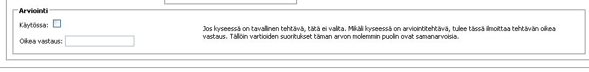

## Kipan osatehtävien määrittely

### Kisapisteiden määrittely

Kisapiste on kaikista yksinkertaisin pistetyyppi. Mikäli tehtävästä saa
esimerikiksi kuusi pistettä syötetään suoraan valmiita pisteitä väliltä
0 -- 6 syötteinä. Mikäli on tarvetta käyttää desimaalieroitinta on sekä
pilkun että pisteen käyttö mahdollista, esim 4,5 tai 4.50 tarkoittavat
samaa. Esimerkkinä tehtävästä on Ensiapu, jossa annetaan suoraan pisteitä
0-5 välillä. Kisapisteitä kuten kaikkia muitakin osatehtävätyyppejä voi
käyttää yksin tai yhdessä.

Kisapisteitä määritellessä syötetään vain kuvaus tehtävän määrittelyyn.

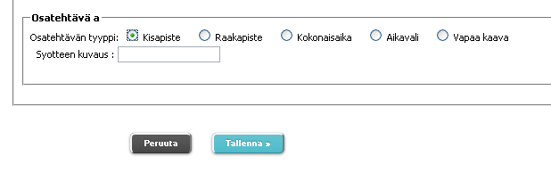

### Raakapisteet

Raakapisteitä käytetään kun esimerkiksi kun vartio vastaa 30 kohdan
tietovisaan ja tarjolla on korkeintaan neljä pistettä. Silloin
muunnetaan että 4 kisapistettä saa 30 oikealla vastauksella. Samoin
raakapisteitä voidaan käyttää kun vartio heittää esimerkiksi keihästä.
Tällöin parhaat pisteet saa pisimmälle heittävä vartio, eikä etukäteen
voida määrittää maksimiarvoa johon vartion suoritusta verrattaisiin.

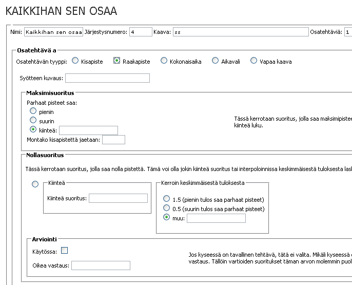

### Raakapisteiden määrittely -- kiinteä

Esimerkki tehtävä, vartio vastaa 30 osaiseen tietovisaan. Maksimipisteet
4p.

Syötteen kuvaus kenttään laitetaan tässä tapauksessa oikeat vastaukset.

Parhaat pisteet saa kiinteä ja arvoksi valitaan 30 eli maksimi oikeat
vastaukset.

Kisapisteitä jaetaan 4.

Nollapistettä tulee kiinteällä suorituksella, eli 0 pistettä jos
halutaan että arviointi on lineaarinen välillä 0 -- 30.

### Raakapisteiden määrittely -- interpolointi

Esimerkki tehtävä, keihäänheitto. Vartion tehtävänä on heittää
mahdollisimman pitkälle keihästä. Maksipisteet 6p. 0.5 keskimmäinen
suoritus on 0p.

Syötteen kuvaus on heiton pituus. Parhaat pisteet saa suurin.
Kisapisteitä jaetaan 6p. Nollasuoritus on 0.5 kerroin.

### Kokonaisaika

Kokonaisaikaa käytetään silloin kun annettu aika on suoritusaika
sinänsä, eikä sitä tarvitse laskea aikojen erotuksesta. Esimerkiksi aika
jonka vartio jaksaa roikkua leuanvetotangossa joka on otettu
ajanottokellolla on kokonaisaikaa kun taas vartion saapumisaika maaliin
-- lähtöaika on aikaväli.

Ajansyöttömuoto on aina HH:MM:SS -- esimerkiksi 13:23:55.

Kipa tukee myös aikaformaatteja jotka ylittää vuorokauden - esimerkiksi
45:23:12. Tämä mahdollistaa, että vartioiden koko radan kiertoaikaa
voidaan mitata.

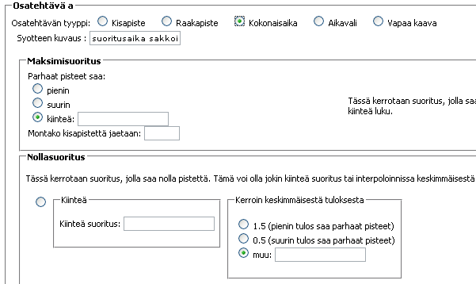

### Kokonaisaika - kiinteät arvot

Esimerkki tehtävä, vartion pitää roikkua tangossa 5 minuuttia.
Maksimipisteet 10p.

Syötteen kuvaus on roikkumisaika. Maksimisuoritus on kiinteä -- 00:05:00.
Kisapisteitä jaetaan 10. Nollasuoritus kiinteä 00:00:00.

### Kokonaisaika -- interpolointi

Esimerkki tehtävä, vartion pitää läpäistä esterata mahdollisimman
nopeasti. Maksimipisteet 6p. 1.5\*keskimmäinen suoritus on 0p.

Syötteen kuvaus on suoritusaika. Parhaat pisteet saa pienin.
Kisapisteitä jaetaan 6p. Nollapisteen saa 1.5 kertoimella.

### Aikaväli

Aikavälin määrittäminen toimii samalla tavalla kuin kokonaisaika on
kuvailtu yllä. Ainoa ero määrittelyssa on, että tulee määritellä kaksi
syötettä. Useimmissa tapauksissa syötteet ovat alkuaika ja loppuaika.
Tällöin laskentalogiikka toimii täysin samoin kuin kuvattu
kokonaisajassa -- järjestelmä vain laskee lisäksi kokonaisajan aikavälin
syötteistä.

Kipa osaa huomioida myös vuorokauden ylittymisen.

### Vapaa kaava

Vapaa kaava mahdollistaa laskennallisesti monimutkaiset tehtävät.
Tärkeää vapaa kaavan kannalta on tietää, että aikojen yksikkö on
sekunti.

#### Esimerkki:

Yliaika kisapisteeseen vapaakaavassa \
pisteitä jaossa 5 \
20 minuutin suorituksella tulee 0 pistettä \
Syötteet:

* a=piste "Suorituspisteet"
* b=aika "Yliaika"

Vartion suorituksen kaava = `a*(1-b/(60*20))` \
Maksimisuoritus, kaava = `5` \
Maksimisuoritus, Montako kisapistettä jaetaan = `5` \
Nollasuoritus, kaava = `0`

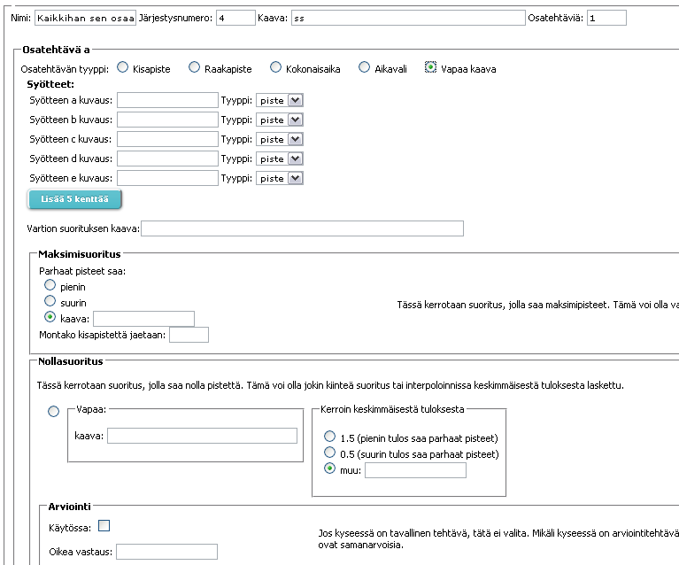

## Testausohjeita

### Yleistä

Kaikki ohjelmistot sisältävät virheitä ja emme suinkaan loukkaannu jos
ilmoitat löytäneesi bugin KiPasta -päinvastoin: koska KiPa projektin
resurssit ovat rajalliset, otamme erittäin mielellämme vastaan
bugiraportteja kuin myös kehitysideoita. Muistathan vain sen, että
kyseessä on vapaaehtoisprojekti, jonka tekijät tekevät projektille työtä
vapaaehtoisesti ja omalla vapaa-ajallaan.

Virheet voidaan karkeasti jakaa laskimen ja käyttöliittymän kesken, alla
ohjeet kumpaakin tapausta varten:

### Virhe laskimessa

Tarkoittaen esimerkiksi sitä että huomaat KiPan laskevan tuloksia
väärin.

1. Tee lyhyt kisa jossa esiintyy nimenomainen laskentaongelma. Nimeä
kisa kuvaavasti, esimerkiksi: hylätty suoritus suunistuksessa
2. Käytä KiPan toimintoa "Määrittele testituloksia", jonka löydät
pääsivulta kohdasta "Kisan Määritykset". Kirjaa ylös oikeat
laskentatulosket tehtävään.
3. Tallenna kisa XML-tiedostoksi toiminnolla "Tallenna kisa", jonka
löydät pääsivulta, kohdasta "Ylläpito".
4. Toimita tallentamasi XML-tiedosto kehittäjille, lisäämme kyseisen
tiedoston testitapaukseksi automaattisiin yksikkötesteihin.

### Virhe käyttöliittymässä

1. Mieti hetki mitä olit tekemässä kun virhe tapahtui, yritä toistaa kyseinen tilanne.
2. Jos pystyt ja osaat, ota ruutukaappaus tilanteesta 3. Tallenna kisa XML-tiedostoksi kohdassa "Virhe laskimessa" annetuilla ohjeilla
4. Ota yhteyttä kehittäjiin ja yritä kuvailla mitä olit tekemässä ja mitä tapahtui, kerro ainakin seuraavat asiat:
    - Käyttämäsi käyttöjärjestelmä (Windows, Macintosh, Linux)
    - Käyttämäsi Internet-selain (Firefox, Internet Explorer, Chrome)
    - ohjeet miten kyseisen vikatilanteen saa toistettua
    - kisatiedosto

Esimerkki hyvästä viestistä:

*Hei, olin määrittelemässä kisaa joka on xml tiedostoliitteenä tämän
sähköpostin mukana. Muutin Hapsenkakkiaiset-vartion nimen
Hapsenkakkiaisiksi ja merkitsin sen keskeyttäneeksi tehtävästä 3
eteenpäin. Tämän jälkeen katsoin punaisen sarjan tuloksia ja kävin
muuttamassa mainitun vartion tuloksen tehtävästä 2, siten että pisteiksi
tuli 1.*

*Tämän jälkeen tuloksia katsoessa ko. vartion tuloksiksi ilmoitetaan
\'none\' ja vasen pikakuvakepalkki on kadonnut (ruutukaappaus myös
tiedostoliitteenä). Internetselaimena käytin Internet explorer 8:aa,
mutta kokeilin toistaa tilanteen myös Firefox 3  :lla, jolla
pikakuvakepalkki näkyi, mutta tuloksissa lukee edelleen \'none\'.
Käyttöjärjestelmä on Windows XP.\'*

Esimerkki äärettömän huonosta viestistä:

*V\_\_u ku toi softa on p\_\_\_a, koitin käyttää ja se laski väärin ja
näytti rumalta. hypätkää kaivoo.*

* Markus.vuorinen@gmail.com
* Frans.korhonen@gmail.com
* Joonas.hirn@gmail.com

## Verkkokäyttö

### Yleistä

Kisapalvelu on suunniteltu tukemaan tuloslaskentatoimistoja, joissa on
useita henkilöitä syöttämässä ja tarkastamassa syötteitä
samanaikaisesti. Tällöin Kipa asennetaan vain yhdelle koneelle ja muut
koneet käyttävät selaimella yhdellä koneella pyörivää Kipaa verkon yli.

Huom! Kipan asennus on täysin samanlainen tietokoneelle käytetään sitä
verkossa palvelimena tai ei.

### Edut

* Samaa sarjaa voi syöttää vaikka kymmenen henkeä yhtäaikaa
* Ohjelma asennetaan vain yhdelle koneelle
* Clientit voivat olla mitä vain koneita, joissa on Internet-selain ja verkkoyhteys
* Mahdollisuus näyttää joltain koneelta tuloksia sitä mukaan kun niitä
  syötetään muilta koneilta.

### Vaatimukset

* Lähiverkko, jossa tietokoneet ovat kiinni
* Yksi tietokone johon on asennettu Kipa (palvelin). Palomuurin tulee sallia http-liikenne porttiin 80.
* n+1 kappaletta tietokoneita, joissa on Internet-selain (client)

### Yleistä lähiverkon / verkon käytöstä

#### Lähiverkko

Kaikkien tietokoneiden pitää olla samassa verkossa niin että niillä on
verkkoyhteys palvelimelle johon Kipa on asennettu. Yhteyden toimivuutta
voi kokeilla vaikka ping \<IP osoite\> komennolla. Palvelimelle
tarvitaan portti 80 auki http-liikennöintiä varten. Jos kisatoimistosta
ei ole pääsy Internettiin kannattaa harkita palomuurin sammuttamisesta
palvelimelta.

#### Internet

On myös mahdollista asentaa Kipa julkisesti Internettiin jolloin kaikki
kisat ovat verkossa näkyvillä kaikille, tällöin kannattaa miettiä onko
turvallisuusriskinä, että kuka tahansa, jolla on osoite, voi mennä
muokkamaan kisan määrittelyitä ja tehtäviä. Lisäturvana kannattaa
harkita käyttäjäautentikoitia osoitteeseen jossa Kipa pyörii. Samoin
rajoituksia voi tulla syrjäseuduilla toimiville kisatoimistoille, joihin
ei saada riittävän hyvää verkkoyhteyttä.

### Tunnettuja ongelmia

* Verkkokäytössä jos useampi kuin yksi henkilö syöttää samaa tehtävää
  samalle sarjalle yhtä aikaa vain myöhemmin tallennettu syöttö
  tallentuu. Myöhemmin tallennettu korvaa aiemmin tallennetun.
* Tietokoneilla on esimerkiksi mokkula- ja WLAN-yhteys päällä yhtäaikaa
  ja siksi tietokone hakee palvelint väärää yhteyttä käyttäen.

## Teknologia

### Käytetyt teknologiat

Kipa on kokonaisuudessaan rakennettu avoimen lähdekoodin päälle.
Komponentit joita on käytetty ympäristön rakentamiseen ovat kaikki
avointa lähdekoodia, Django, Python, SQLite sekä Apache.

### Arkkitehtuuri

Kisapalvelu, Kipa, on puhdas web-applikaatio. Laskenta on toteutettu
Pythonilla. Web näkymät on rakennettu Django-ohjelmistokehyksen päälle,
joka on toteuttu pythonilla. Kaikki syötteet tallennetaan sqlite-kantaan,
jonka yhteydet hoitaa Django. SQLite-toiminnalisuus tulee Pythonin mukana.
Web-palvelimena on käytetty Apachea sekä djangon kehitysserveriä, mutta
ei pitäisi olla esteitä toteuttaa toiminnallisuutta millä tahansa
web-palvelimella joka tukee Pythonin suorittamista, dokumentaation
mukaan ainakin lighthttpd tulisi olla tuettu samoin kuin mikä tahansa
käyttöjärjestelmä tai laite jolle nämä ovat saatavilla. Django tukee
myös MySQL sekä PostegreSQL kantoja, pienellä muutoksella settings.py
tiedostoon. Mikäli haluat rakentaa julkisen verkkopalvelun jossa voluumi
voi olla kovempi kannattaa tämä pitää mielessä.

### Suorituskyky ja skaalautuvuus

Normaalikäytössä ei Kipa nosta mainittavasti koneen CPU kuormaa.
Yhdellä kannettavalla voidaan hyvin ajaa kisatoimiston palveluja.
Piikkittäisiä kuormituksia syntyy ainoastaan tulosten laskemisesta,
isohkoissa kilpailussa, jossa on tuhansia syötteitä, vie kaavojen
parsiminen ja laskenta isoille sarjoille joissain tapauksissa joitain
sekunteja. Testien mukaan kuorma kuitenkin säikeistyy käytössä olevien
threadien määrän mukaan - kuitenkin vain yksi per istunto.

Kehitysvaiheessa on testejä ajettu pitkään (muinaisella) 850Mhz
Pentiumilla jossa 128Mt muistia - tälläiselläkään koneella ei
suorituskykyongelmia tule muuta kuin hetkellisesti laskennassa.

Testimielessä Kipan kantaan on ajettu yhtäaikaa parikymmentä kilpailua
kokonaisuudessaan, jolloin syötteiden määrä on noussut tuhansiin, tällä
ei kuitenkaan ole nähty olevan vaikutusta suorituskykyyn.

### Testattuja käyttöjärjestelmiä ja komponentteja

* Windows 7 32bit/64bit, Windows Vista 32bit
* Ubuntu 8.10, 9.04, 9.10, Debian 5, Arch Linux
* Python 2.5, Python 2.6
* Django 1.0 & 1.1
* Apache 2.2

## Lisenssi

Kipa on kokonaisuudessaan julkaistu GPL v3 lisenssin alla. Tämä
tarkoittaa, että kuka tahansa saa käyttää ilmaiseksi Kipaa niin
ilmaisessa kuin kaupallisessakin tarkoituksessa. Mikäli haluaa kuitenkin
kehittää järjestelmää eteenpäin vaadimme kunnioittamaan GPL v3
lisenssiä.

Sourceforge sivustolla projektiin kehittämiseen liittyvää tietoa,
lähdekoodeja yms. Web-osoite viittaa projektin alkuperäiseen työnimeen
Tupa2.

http://tupa2.sourceforge.net/

http://sourceforge.net/projects/tupa2/

## Kehitystyö ja tekijät

### Kehitysprojekti

Kipaa on kehitetty Espoolaisten partiolaisten voimin korvaamaan Sakari
"Sacu" Koutin koodaamaa Tupa ohjelmaa ja vastaamaan ajan haasteisiin.
Kehitystyö alkoi syksyllä 2008 Lokakuussa ja ensimmäinen valmis versio
valmistui Keväällä 2011. Espoon Partiotuki ry. on ollut taustayhteisönä
ja tukenut taloudellisesti projektia sen kehitysaikana.

### Versio 2.0

Kipa projektin venyessä on tullut ilmeiseksi että kaikkia haluttuja
ominaisuuksia ei saatu tähän versioon mukaan. Suunniteltuja versioita,
joita emme ehditty toteuttaa

* PDF Export
* Mobiili GUI
* Käyttäjäautentikointi (Alfa versio valmis)
* Tuki Emit tietojen sisäänottoon
* Mac OS X installer

### Tekijät

* Joonas "Jones" Hirn
* Visa "Viski" Jokelainen
* Frans "Ransu" Korhonen
* Samu Wikstedt
* Markus "Mara" Vuorinen

Muuta projektiryhmää joka on ollut enemmän tai vähemmän projektin
vaiheissa mukana, Janne "Peltsi" Peltola, Teemu Penttilä, Martti
"Mara" Suontausta

### Yhteydenotot

Mikäli sinulla on kiinnostusta tietää enemmän hankkeesta, jatkaa
kehitystyötä tausta järjestön kanssa tms. suosittelemme ottamaan
yhteyttä <ept@partio.fi>.

Projektiryhmän jäsenet ovat tätä kirjoittaessa vielä varmasti
kiinnostuneita auttamaan eteenpäin mikäli kiinnostuneita
jatkokehityksestä löytyy.

## Apachen konfigurointi

Apachen httpd.conf-tiedostoon pitää lisätä seuraava tekstinpätkä, jotta
voidaan ajaa Python-koodia sekä djangoa. Alla oleva konfiguraatio
edellyttää että tiedostot ovat kopioitu hakemistoon /data (Linux/Unix)
tietokoneilla.

```
<Location "/kipa/">
    SetHandler python-program
    PythonHandler django.core.handlers.modpython
    SetEnv DJANGO_SETTINGS_MODULE web.settings
    PythonDebug On
    PythonPath "['/data'] + sys.path"
</Location>
```

## Kaavat

### Lineaarinen interpolointi

Lineaarinen interpolointi tehdään kaavalla

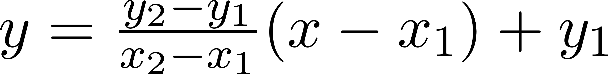

, jossa

```
x1 = nollat antava suoritus
y1 = 0
x2 = täydet antava suoritus
y2 = jaettavat pisteet
x = suoritus
```

, jolloin se sievenee muotoon

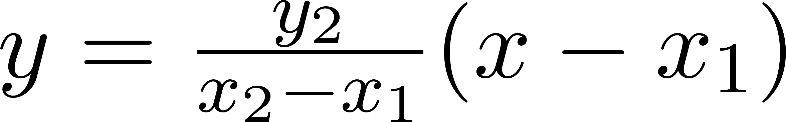

, jonka toteuttaa pikafunktio: `interpoloi(x,x2,y2,x1)`.

### Osatehtävän kaavapohja

Jokaisen osatehtävän (poislukien kisapiste jonka kaava on \_a\_)
määritys pohjautuu samaan kaavapohjaan jonka parametrit vain vaihtelevat:

```
interpoloi(arvio(vartion_kaava-oikea),
    parhaan_haku(arvio(parhaan_kaava-oikea)),
    jaettavat,
    nollan_kerroin*tapa(arvio(nollan_kaava-oikea)))
```

### Kaavan syntaksi

Kaavoissa voi käyttää matematiikan perusoperaattoreita +-\*/, sulkuja
sekä Kipaan määritettyjä funktioita. Laskujärjestyksessä noudatetaan
matematiikan sääntöjä. Osatehtävän syötteisiin viitataan
niiden nimillä (a -- z), jolloin ne tarkoittavat laskennassa kulloinkin
olevan vartion kyseistä syötettä. Hierarkiassa voi liikkua ylöspäin
lisäämällä muuttujan eteen pisteen. Esim. \_.a\_ tarkoittaa kaikkien
saman sarjan vartioiden kyseisen suorituksen lukujoukkoa. Hierarkiassa
voi liikkua mihin tahansa tehtävään saman sarjan sisällä.
Interpoloinneissa voidaan käyttää \_muk\_ lukujoukkoa suodatettamaan
ulkopuoliset vartiot pois. (esim \_.a\*muk\_)

Esimerkkejä:
```
(a+b+c)/3
.a
min(.a)
.a*muk
(.a+.b)*muk
..a.b
...ampuhmahaava.d.a
max(...pidempi:piipeli.a)
```

### Funktiot

* `min(lukujoukko)` hakee lukujoukon pienimmän arvon
* `max(lukujoukko)` hakee lukujoukon suurimman arvon
* `med(lukujoukko)` hakee lukujoukon mediaanin
* `avg(lukujoukko)` hakee lukujoukon keskiarvon
* `abs(luku)` laskee luvun itseisarvon
* `interpoloi(x,x2,y2,x1[,y1])` lineaarinen interpolointi
* `aikavali(alku,loppu)` kahden kellonajan välinen aika
* `sum(lukujoukko)` lukujoukon summa

### Parametrit

Parametrit ovat yksittäisiä palikoita, joiden avulla on helppo muokata käyttöliittymästä haluttuja kaavan osia.
Jokainen parametri on merkkijono, jonka nimeä vastaava kohta kaavassa korvataan.
Kaikki parametrit tulee määrittää, joten käyttämättömät parametrit määritetään
tyhjiksi. Seuraavassa peruskaavan parametrit ja niiden arvovaihtoehdot.

- **arvio** -- Arvionti käytössä:
    * `abs` (kaikki paitsi aikaväli)
    * "" eli tyhjä merkkijono (ei käytössä)
- **oikea** -- Arviontitehtävän oikea vastaus
    * Desimaaliluku
    * `()` (ei käytössä)
- **vartions_kaava** -- Vartion suorituksen laskentakaava
    * `a` (raakapiste, kokonaisaika)
    * `aikavali(a,b)` (alku- ja loppuaika)
    * Vapaamuotoinen kaava (vapaa kaava)
- **parhaan_haku** -- Hakufunktio jos haetaan parasta suoritusta
    * `min` lukujoukon pienin (kaikki)
    * `max` lukujoukon suurin (kaikki)
- **parhaan_kaava** -- Parhaan suorituksen kaava
    * `suor\*muk` (kaikki) Kaikkien sarjassa mukana olevien vartioiden suoritusten lukujoukko.
    * vapaamuotoinen kaava (vapaa kaava)
- **jaettavat** -- Tehtävässä jaettavat pisteet.
    * desimaaliluku (kaikki)
- **nollan_kerroin** -- Kerroin interpoloinnin nollasuoritukselle
    * desimaaliluku (kaikki)
    * `1` (ei käytössä)
- **tapa** -- keskimmäinen suorituksen laskutapa nollasuoritukselle.
    * `med` lukujoukon mediaani (kaikki)
    * `avg` lukujoukon keskiarvo (kaikki)
    * "" eli tyhjä merkkijono (ei käytössä)
- **nollan_kaava** -- Nollasuorituksen kaava
    * `suor\*muk` (kaikk) Kaikkien sarjassa mukana olevien vartioiden suoritusten **vartion_kaava**-parametrillä laskettu lukujoukko.
    * vapaamuotoinen kaava (vapaa kaava)

`suor` =  kaavalla lasketut kaikkien vartioiden suoritukset


## Kehittäjille

### Kipan kehitykseen hyödyllistä informaatiota 

Vähimmäiset toimintavaatimukset kehitysympäristölle:

* Python + tietokanta esim. sqlite3
* Django

Hyöylliset henkilökohtaiset tekniset tiedot & taidot.

* Windows / Linux
* Apache
* Tietokannat
  * sql
  * mysql
  * sqlite
* Python
* Luokat, olio-ohjelmointi
* Merkkijonot: (string,unicode)
* Taulukot (table,tuple)
* Decimal (luokka)
* xml.dom.minidom XML-parseri
* Unittest -- testausluokat
* RE - Regular expressions
* Merkkijonohaut
* käyttöjärjestelmän tiedot.
* Django
  * Kokoonpano (apache)
  * Datamalli
  * Formit
  * Templatet
  * Middleware
  * Testaus
  * Unicode
  * Authentication
  * Admin-sivu
* HTML
  * taulukot
  * formit
  * css
  * javascript

### Järjestelmän Hallinta - manage.py

```
python manage.py runserver
```

Käynnistää kehitypalvelimen paikalliselle koneelle porttiin 8000

Jonka jälkeen kipan pitäisi löytyä selaimella osoitteesta:
[127.0.0.1:8000/tupa](http://127.0.0.1:8000/tupa)

Järjestelmä käyttää juuresta löytyvää tupa.db tiedostoa.

```
python manage.py testserver [tietokantapohja.xml]
```

Käynnistää testipalvelimen. Muuten samanlainen kuin runserver,
paitsi että käyttää virtuaalista tietokantaa muistissa. Ei tee mitään
muutoksia tiedostoihin. Turvallinen erilaisiin kokeiluihin.
Voidaan täyttää halutulla tietokantapohjalla (fixture). esim.

```
python manage.py testserver fixtures/tests/katuu.xml
```

```
python manage.py test
```

Ajaa järjestelmän yksikkötestit. Testaa erinäisiä asioita järjestelmässä
testidatan pohjalta:

* Laskee oikeita tuloksia
* kaatuuko datan tilanteissa
* Tallentaa tietoa oikein.

Käyttää testidatana kaikkia fixtures/tests/ löytyviä XML-päätteisiä
tietokantapohjia.

```
python manage.py syncdb
```

päivittää tietokantatiedoston "tupa.db" "models.py" päivitetyn määrittelyn perustella.

VAROITUS: Mikäli tietokannan rakenne olennaisesti muuttuu, on
mahdollista ettei se enään ole yhteensopiva jo olemassa olevan tietokannan kanssa.
Näin tietokantaa voi olla vaikea enään muokata päivityksen jälkeen.
On suositeltavaa varmuuskopioida ja nollata tietokanta aina ennen päivittämistä.

```
python manage.py flush
```

Tyhjentää kaikki tietokantataulut.

### Järjestelmän Asetukset - settings.py

Kaikki palvelun järjestelmäkohtaiset asetukset. Djangon dokumentaatio
kattaa tämän aika hyvin. Tässä käsitellään lähinnä Kipaan liittyvät
poikkeamat.

```
Hakemisto=os.path.normpath(os.path.dirname(\_\_file\_\_))
```

Hakee käyttöjärjestelmältä settings.py hakemiston ja käyttää kipan
hakemistona.

Ongelmatilanteissa voi koittaa määrittämällä merkkijonon manuaalisesti.

```
DEBUG = True
TEMPLATE_DEBUG = DEBUG
```

Debug moodit. Systeemi näyttää djangon virhesivuja kaatumistilanteissa.
(Vain kehityskäyttöön.)

```
LOGGING=False
```

Kipan loki. Kirjaa laskennan välivaiheita laskenta.log tiedostoon. (Vain
kehityskäyttöön)

```
RECORDING=True
```

Nauhoittaa jokaisen serverillä tapahtuvan sivutallennuksen. Juuresta
löytyvään record.xml-tiedostoon, mikäli se on olemassa. Tarkoitettu
tiedontallennukseen testien luontia varten.

### Alkuperäinen skripti

```
#!/bin/bash*

# Tama skripti yrittaa asentaa kokonaisuudessaan tulospalvelun
# Ubuntuserverille Ei takuuta toiminnasta, mutta kannattaa tutkia
# jos ja kun haluaa joskus korjailla...

# Tehdaan kansio johon tulee Django + Python + Tietokanta
mkdir /data/

# Tehdaan kansio johon tulee media tiedostot
mkdir /var/www

# Kopioidaan muut kuin media tiedostot
cp -r web /data

# Linkataan media tiedostot yhteen
ln -s /data/web/media /var/www/kipamedia

# Asennetaan komponentit
apt-get install -y python apache2 python-django \
python-reportlab libapache2-mod-python

# Kopioidaan Apache konfiguroinnit "yli"
cp ./httpd.conf /etc/apache2/

#Kopidaan redirect
cp ./index.html /var/www/

# Korjataan ACL oikeudet
chown -R www-data /data/web/

# Restartti apachelle
/etc/init.d/apache2 restart

# Ja menoks
firefox localhost
```

## Selitykset lähdekooditiedostoista ja hakemistoista

* `web/`
    - `urls.py & tupa/urls.py`
        * Pää osoitemäärittelyt. Määrittelee millä hakemistopoluilla näkymät aukeavat.
        * Ensimmäinen serveri tason toinen kipaan liittyen.
    - `manage.py`
        * Hallinta
    - `settings.py`
        * Asetukset
* `web/tupa/`
    - `admin.py`
        * Djangon luoman admin sivun määritely.
        * Riippuvuudet: Python,Django,models.formit.py
    - `AritmeettinenLaskin.py`
        * Laskin joka laskee matemaattisia lauekeita merkkijonosta jossa on merkejä +-/\*() sekä numeroita.
        * Rippuvuus: Python
    - `duplicate.py`
        * Tiedon monistaminen. Tehtävien kopiointi, XML tietokantatiedoston luonti.
        * Riippuvuudet: Python,Django,models.py
    - `formit.py`
        * Perus formien määritys. Formeja käytetään näkymissä (views.py)
        * Riippuvuudet: Python,Django,models.py
    - `logger.py`
        * Kirjaus, ja nauhoitus. Kirjaa laskimen välivaiheita. Nauhoittaa post dataa.
        * Riippuvuudet: Python,settings.py,duplicate.py
    - `models.py`
        * Django datamalli. Koko systeemin ydin.
        * Datamalliin pohjatuu sekä tietokanta että näkymät.
        * Myös laskin käyttää datamallia tiedon haussa.
        * Riippuvuudet: Python,Django
    - `TehatavanMaaritys.py`
        * Tehtävän määrityksen formit.
        * Riippuvuudet: models.py,formit.py
    - `tests.py`
        * Unit testit. Testaa järjestelmää erilaisilla testeillä.
            - Aritmeettisen laskimen perustoimitukset.
            - Sarjakohtaisten tulosten testaus.
            - Kaikkien näkymien avautuminen testidatalla.
            - Tiedon tallentuminen näkymillä.
        * Riippuvuudet:
            - Python
            - Django
            - models.py
            - views.pymAritmeettinenLaskin.py
            - TulosLaskin.py
    - `Tuloslaskin.py`
        * Laskee tulokset tietokannan tietojen pohjalta
        * Riippuvuudet:
            - Python
            - Django
            - models.py
            - logger.py
            - AritmeettinenLaskin.py
    - `urls.py`
        * Näkymien hakemistopolut.
        * Riippuvuudet: Python,Django,models.py
    - `views.py`
        * Näkymät, jokaisen sivun aivot.
        * Riippuvuudet:
            - Python
            - Django
            - models.py
            - formit.py
            - TehtavanMaaritys.py
            - logger.py
            - duplicate.py
* `web/tupa/templates/`
    - `404.html`
    - `500.html`
    - `base.html`
* `web/tupa/templates/tupa/`
    - Näkymien Fixtuurit
* `web/tupa/templates/tupa/forms/`
    - Formikohtaiset fixtuurit
* `web/media/`
    - kuvat
    - css
    - yms. tiedostot
